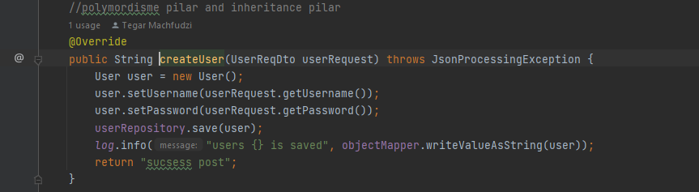
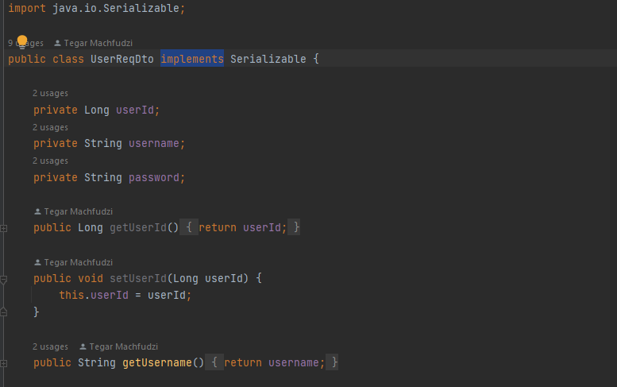
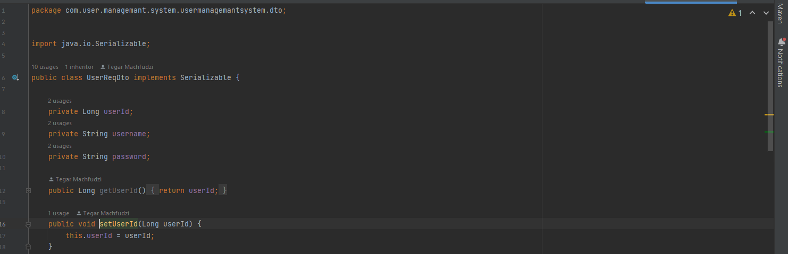

#Noted Konsep OOP

1. Polimorfisme:
    Polimorfisme merupakan sebuah konsep oop dimana class memiliki banyak bentuk atau fungsi yang berbeda
   contoh dari polimorfisme pada projek ini ada pada UserService yang mengoveride ke Clas UserServiceImpl
    ini pada contoh method createUser yang mengoveride ke class userServiceImpl
    
    
    ini contoh method yang sama yang di overide dari class userService    
    

   2. Encapsulation:
       encapsulation yaitu berarti memastikan data sensitif di dalam suatu class dan object di sembunyikan dari user yang tidak di inginkan 
       .mendeklarasikan atribute atau variable sebagai private
       .menyediakan method publik get dan set untuk mengakses dan memperbarui nilai variable
       pada projek saya ini saya biasanya menggunakan fungsi encapsulation pada class data tranfer objek
       ini contoh nya
       
       pada gambar contoh ini username memiliki variable atribute private dan saya menyediakan method publik set dan get 
   pada variable yang sudah di declare di atas
   
   3. Inheritance:
        inharitance atau pewarisan sebuah class yang isi atau object nya mirip dengan claas yang sudah ada
        salah satu contoh nya ada di class dto userResponse yang meng extend userReqDto
        
        
        
        jadi userResponse ini mengambil data object yang di extend ke userReqDto ini
   4. 
    

